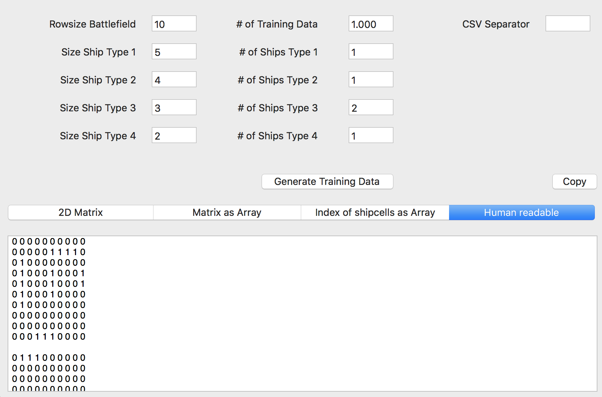

#  A battleship training data generator for machine learning

I've implemented this generator to create a large set of training data for a TensorFlow model, which should be able to play battleship. The generator was implemented in a quick and dirty way, so there is a lot of room for optimizations. I've skipped further optimizations, because generating 1000 battlefields of size (10x10) takes less than a second on my computer.

The output is possible in a CSV format as a 2D matrix or an Array.

## Matrix:

>0,1,1,1,1,0,0,0,1,0

>0,0,0,0,0,0,0,0,1,0

>0,0,0,0,0,0,0,0,1,0

>1,0,0,0,0,0,0,0,1,0

>1,0,0,0,0,0,0,0,0,0

>1,0,0,0,1,0,0,0,0,0

>1,0,0,0,1,0,0,0,0,0

>0,0,0,0,1,0,0,0,0,0

>0,0,0,0,1,0,0,0,0,0

>0,0,0,0,0,0,0,0,0,0

## Array:
`0,0,0,0,0,0,0,0,0,0,0,0,0,0,0,0,0,0,0,0,0,0,1,0,0,0,0,0,0,0,0,0,1,0,0,0,0,0,0,0,0,0,1,0,0,1,0,0,0,1,0,0,1,0,0,1,0,0,0,1,0,0,0,0,0,1,0,0,0,1,0,0,0,0,0,1,0,0,0,1,0,0,0,0,0,0,0,0,0,0,0,1,1,1,1,0,0,0,0,0`
